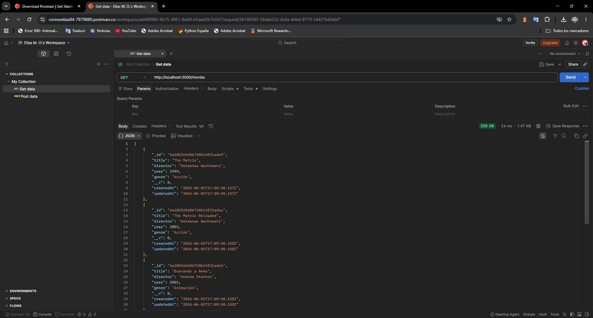
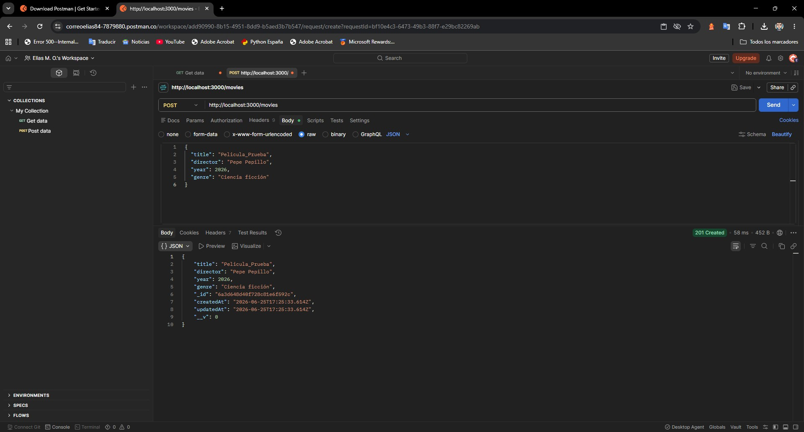
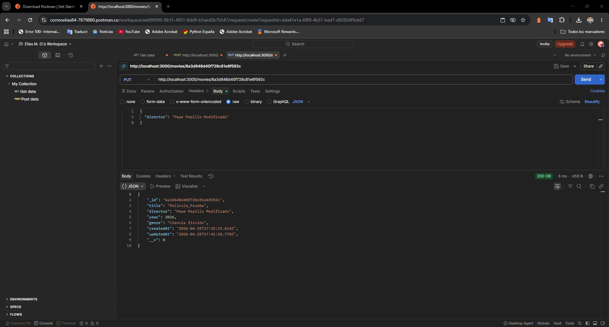
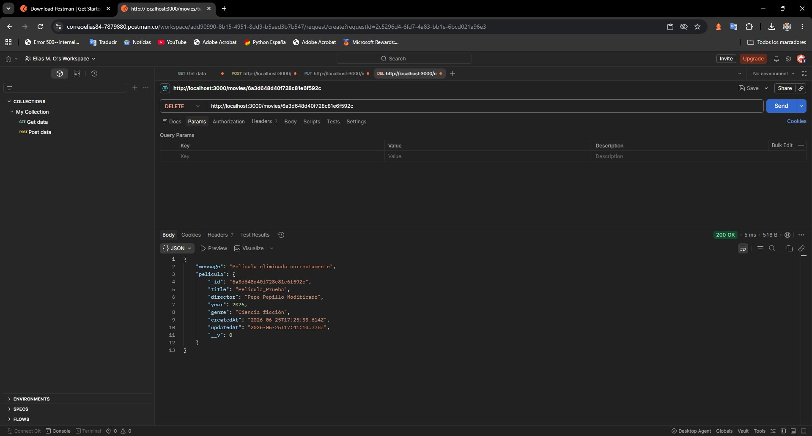

# Proyecto 5 NoSQL

Autor: Elías Martínez Ortega

## Descripción del Proyecto
Este proyecto es la entrega del Proyecto 5 de NoSQL para 2º de DAM. Consiste en una API REST desarrollada con Node.js, Express y Mongoose para gestionar una base de datos local (MongoDB) con películas y cines.

## Requisitos realizados
* Creación de un CRUD completo (GET, POST, PUT, DELETE) para la colección de películas.
* Directorio de rutas creado. Las rutas se han movido a `routes/movie.routes.js` para limpiar el index.
* Creación de un nuevo modelo `Cinema` en `models/Cinema.js` que relaciona los cines con las películas usando referencias (ObjectId).
* Control de errores básico implementado en todos los endpoints.
* Pruebas de los endpoints realizadas y documentadas con Postman.

## Pruebas de funcionamiento (Postman)

A continuación se muestran las capturas con las pruebas realizadas a los endpoints de la API:

### 1. Arranque del servidor y conexión a base de datos

### 2. Listar todas las películas (GET)

### 3. Crear una nueva película (POST)

### 4. Modificar una película existente (PUT)

### 5. Eliminar una película (DELETE)
